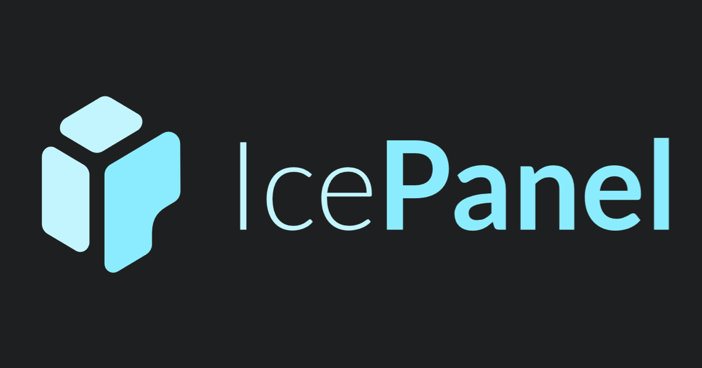
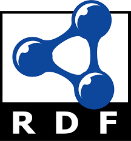

 

    

 

Designed by [Agile Lab](https://www.agilelab.it/), Witboost is a versatile platform that addresses a wide range of sophisticated data engineering challenges. It enables businesses to discover, enhance, and productize their data, fostering the creation of automated data platforms that adhere to the highest standards of data governance. Want to know more about Witboost? Check it out [here](https://www.agilelab.it/witboost) or [contact us!](https://www.agilelab.it/contacts)

This repository is a guide to our Starter Kit meant to showcase Witboost's integration capabilities and provide a "batteries-included" product.

# Witboost Starter Kit

- [Provisioners](#provisioners)
- [Templates](#templates)
- [Practice Shaper Presets](#practice-shaper-presets)

## Provisioners

### What's a Specific Provisioner?

A Specific Provisioner is a microservice which is in charge of deploying components that use a specific technology. When the deployment of a Data Product is triggered, the platform generates it descriptor and orchestrates the deployment of every component contained in the Data Product. For every such component the platform knows which Specific Provisioner is responsible for its deployment, and can thus send a provisioning request with the descriptor to it so that the Specific Provisioner can perform whatever operation is required to fulfill this request and report back the outcome to the platform.

You can learn more about how the Specific Provisioners fit in the broader picture [here](https://docs.witboost.agilelab.it/docs/p2_arch/p1_intro/#deploy-flow).

### Available Specific Provisioners and Scaffolds

We provide two main kinds of projects:

- Provisioners: these are actual implementations for a specific technology that you can customize to suit your needs
- Scaffolds: these are projects that you can start from if you want to implement a provisioner yourself

| Tech                                             | Kind        | Project                                                                                                              | Scope                                    | Supported components      | Notes                                                                                                                                |
|--------------------------------------------------|-------------|----------------------------------------------------------------------------------------------------------------------|------------------------------------------|---------------------------|--------------------------------------------------------------------------------------------------------------------------------------|
|     | Provisioner | [Airbyte SP](https://github.com/agile-lab-dev/witboost-airbyte-specific-provisioner)                                 | ELT - Airbyte                            | Workload                  |                                                                                                                                      |
|        | Provisioner | [Azure ADLS Storage Area SP](https://github.com/agile-lab-dev/witboost-azure-adls-storage-area-specific-provisioner) | Object Storage - Azure Data Lake Storage | Storage Area              | Deployable with [Azure ADLS Umbrella Chart](https://github.com/agile-lab-dev/witboost-azure-adls-storage-area-helm)                  |
|      | Provisioner | [CDP Impala SP](https://github.com/agile-lab-dev/witboost-cdp-impala-specific-provisioner)                           | SQL Query Engine - CDP Impala            | Output Port               |                                                                                                                                      |
|          | Provisioner | [CDP S3 SP](https://github.com/agile-lab-dev/witboost-cdp-s3-specific-provisioner)                                   | Object Storage - CDP S3                  | Output Port               |                                                                                                                                      |
|       | Provisioner | [CDP Spark SP](https://github.com/agile-lab-dev/witboost-cdp-spark-specific-provisioner)                             | Data Processing - CDP Spark              | Workload                  |                                                                                                                                      |
|       | Provisioner | [CDP HDFS SP](https://github.com/agile-lab-dev/witboost-cdp-hdfs-specific-provisioner)                               | Distributed File System - CDP HDFS       | Output Port, Storage Area |                                                                                                                                      |
|     | Provisioner | [MWAA SP](https://github.com/agile-lab-dev/witboost-mwaa-specific-provisioner)                                       | Scheduling - Airflow/MWAA                | Workload                  |                                                                                                                                      |
|      | Provisioner | [Hasura SP](https://github.com/agile-lab-dev/witboost-hasura-specific-provisioner)                                   | GraphQL - Hasura                         | Output Port               | Needs the [Hasura Authentication Webhook and Role Mapper](https://github.com/agile-lab-dev/witboost-hasura-auth-webhook-role-mapper) |
|  | Provisioner | [Snowflake SP](https://github.com/agile-lab-dev/witboost-snowflake-specific-provisioner)                             | DWH - Snowflake                          | Output Port, Storage Area |                                                                                                                                      |
|        | Scaffold    | [Java Scaffold](https://github.com/agile-lab-dev/witboost-java-scaffold)                                             | Generic - Java                           | NA                        |                                                                                                                                      |
|      | Scaffold    | [Python Scaffold](https://github.com/agile-lab-dev/witboost-python-scaffold)                                         | Generic - Python                         | NA                        |                                                                                                                                      |
|   | Scaffold    | [Terraform Scaffold](https://github.com/agile-lab-dev/witboost-terraform-scaffold)                                   | Generic - Terraform                      | NA                        |                                                                                                                                      |

## Templates

### What's a Template?

A Template is a tool that helps create components inside a Data Mesh. Templates help establish a standard across the organization. This standard leads to easier understanding, management and maintenance of components. Templates provide a predefined structure so that developers don't have to start from scratch each time, which leads to faster development and allows them to focus on other aspects, such as testing and business logic.

For more information, please refer to the [official documentation](https://docs.witboost.agilelab.it/docs/p1_user/p6_advanced/p6_1_templates/#getting-started).

### Available Templates

| Tech                                             | Component    | Project                                                                                                     | Scope                              | Specific Provisioner                                                                                                 | Notes                                                                                                                                    |
|--------------------------------------------------|--------------|-------------------------------------------------------------------------------------------------------------|------------------------------------|----------------------------------------------------------------------------------------------------------------------|------------------------------------------------------------------------------------------------------------------------------------------|
|          | Data Product | [Data Product](https://github.com/agile-lab-dev/witboost-data-product-template)                             | NA                                 | No Specific Provisioner needed                                                                                       |                                                                                                                                          |
|        | Storage Area | [Azure ADLS Storage Area](https://github.com/agile-lab-dev/witboost-azure-adls-storage-area-template)       | Data Lake Storage - Azure          | [Azure ADLS Storage Area SP](https://github.com/agile-lab-dev/witboost-azure-adls-storage-area-specific-provisioner) |                                                                                                                                          |
|      | Output Port  | [CDP CDW Impala Output Port](https://github.com/agile-lab-dev/witboost-cdp-cdw-impala-output-port-template) | SQL Query Engine - CDP CDW Impala  | [CDP Impala SP](https://github.com/agile-lab-dev/witboost-cdp-impala-specific-provisioner)                           |                                                                                                                                          |
|          | Output Port  | [CDP DL S3 Output Port](https://github.com/agile-lab-dev/witboost-cdp-dl-s3-output-port-template)           | Object Storage - CDP DL S3         | [CDP S3 SP](https://github.com/agile-lab-dev/witboost-cdp-s3-specific-provisioner)                                   |                                                                                                                                          |
|       | Storage Area | [CDP HDFS Storage Area](https://github.com/agile-lab-dev/witboost-cdp-hdfs-storage-area-template)           | Distributed File System - CDP HDFS | [CDP HDFS SP](https://github.com/agile-lab-dev/witboost-cdp-hdfs-specific-provisioner)                               |                                                                                                                                          |
|      | Output Port  | [Hasura Output Port](https://github.com/agile-lab-dev/witboost-hasura-output-port-template)                 | GraphQL - Hasura                   | [Hasura SP](https://github.com/agile-lab-dev/witboost-hasura-specific-provisioner)                                   |                                                                                                                                          |
|  | Output Port  | [Snowflake Output Port](https://github.com/agile-lab-dev/witboost-snowflake-output-port-template)           | DWH - Snowflake                    | [Snowflake SP](https://github.com/agile-lab-dev/witboost-snowflake-specific-provisioner)                             |                                                                                                                                          |
|  | Storage Area | [Snowflake Storage Area](https://github.com/agile-lab-dev/witboost-snowflake-storage-area-template)         | DWH - Snowflake                    | [Snowflake SP](https://github.com/agile-lab-dev/witboost-snowflake-specific-provisioner)                             |                                                                                                                                          |
|  | Workload     | [Snowflake SQL Workload](https://github.com/agile-lab-dev/witboost-snowflake-sql-workload-template)         | Data processing - Snowflake        | No Specific Provisioner needed                                                                                       | It's triggered by an orchestrator through the [MWAA Workload Template](https://github.com/agile-lab-dev/witboost-mwaa-workload-template) |
|     | Workload     | [Airbyte Workload](https://github.com/agile-lab-dev/witboost-airbyte-workload-template)                     | ELT - Airbyte                      | [Airbyte SP](https://github.com/agile-lab-dev/witboost-airbyte-specific-provisioner)                                 |                                                                                                                                          |
|       | Workload     | [CDP CDE Spark Workload](https://github.com/agile-lab-dev/witboost-cdp-cde-spark-workload-template)         | Data Processing - CDP CDE Spark    | [CDP Spark SP](https://github.com/agile-lab-dev/witboost-cdp-spark-specific-provisioner)                             |                                                                                                                                          |
|         | Workload     | [DBT Workload](https://github.com/agile-lab-dev/witboost-dbt-workload-template)                             | Data processing - DBT              | No Specific Provisioner needed                                                                                       |                                                                                                                                          |
|     | Workload     | [MWAA Workload](https://github.com/agile-lab-dev/witboost-mwaa-workload-template)                           | Scheduling - Airflow/MWAA          | [MWAA SP](https://github.com/agile-lab-dev/witboost-mwaa-specific-provisioner)                                       |                                                                                                                                          |

### Other integrations

In this section you can find a gallery of possible integrations, they are not production ready as the others, but anyway a good starting point to address specific use cases and to understand the Witboost possibilities

| Tech                                             | Kind        | Project                                                                                    | Scope                         | Supported components      | Notes                                                                                                                                |
|--------------------------------------------------|-------------|--------------------------------------------------------------------------------------------|-------------------------------|---------------------------|--------------------------------------------------------------------------------------------------------------------------------------|
|          | Adapter    | [Ice Panel](https://github.com/agile-lab-dev/IcePanelC4-Adapter)                             | C4 Architecture Diagram                        | Data Product             |   Need an IcePanel license       |
|          | Adapter    | [Tonic.ai](https://github.com/agile-lab-dev/TonicAI-Adapter)                             | Synthetic Data Generation                     | Output Port              |   Need a Tonic.ai license       |
|          | Adapter    | [DCAT - OWL - RDF](https://github.com/agile-lab-dev/DCAT-OWL-Adapter)                             | Data Catalog                     | Output Port              |   Need a RDF Triple Store endpoint       |

## Practice Shaper Presets

### What's the Practice Shaper?

The **Practice Shaper** is the main and most impactful Witboost setting that models entities (domains, systems, components, templates) as nodes of a fully-configurable **property graph**.

This enables data-oriented organizations to shape Witboost based on their unique use cases, structure, and needs.

Thanks to the Practice Shaper, a company can approach any project scenario in data (**Data Landscape**), such as Data Mesh, Business Intelligence, Machine Learning and others, by defining which practices are enabled and regulated, with the possibility to define technological and methodological guardrails.

Refer to the [Witboost documentation](https://docs.witboost.com) to learn more about Practice Shaper and Data Landscapes.

### Available Presets

The [Practice Shaper Presets repository](https://github.com/agile-lab-dev/witboost-practice-shaper-presets) provides some ready-to-import Data Landscapes, allowing organizations to quickly set up and customize their witboost environment to suit specific business needs.

## License

This project is available under the [Apache License, Version 2.0](https://opensource.org/licenses/Apache-2.0); see [LICENSE](LICENSE) for full details.

## About us

 

    

 

Agile Lab creates value for its Clients in data-intensive environments through customizable solutions to establish performance driven processes, sustainable architectures, and automated platforms driven by data governance best practices.

Since 2014 we have implemented 100+ successful Elite Data Engineering initiatives and used that experience to create Witboost: a technology-agnostic, modular platform, that empowers modern enterprises to discover, elevate and productize their data both in traditional environments and on fully compliant Data mesh architectures.

[Contact us](https://www.agilelab.it/contacts) or follow us on:

- [LinkedIn](https://www.linkedin.com/company/agile-lab/)
- [Instagram](https://www.instagram.com/agilelab_official/)
- [YouTube](https://www.youtube.com/channel/UCTWdhr7_4JmZIpZFhMdLzAA)
- [Twitter](https://twitter.com/agile__lab)
