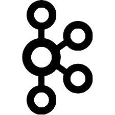
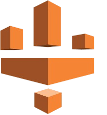
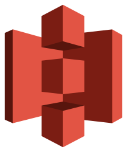
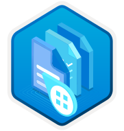
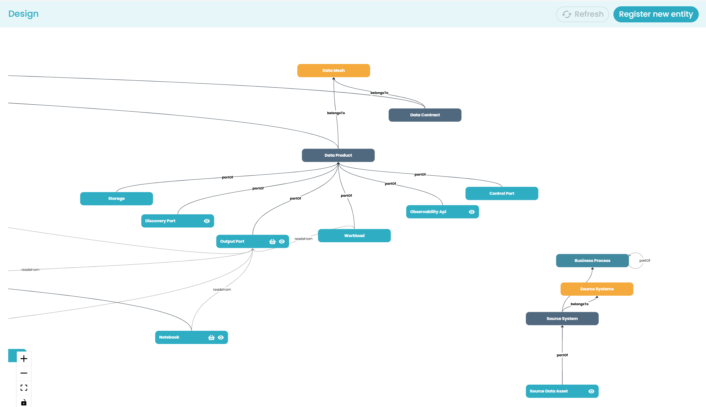
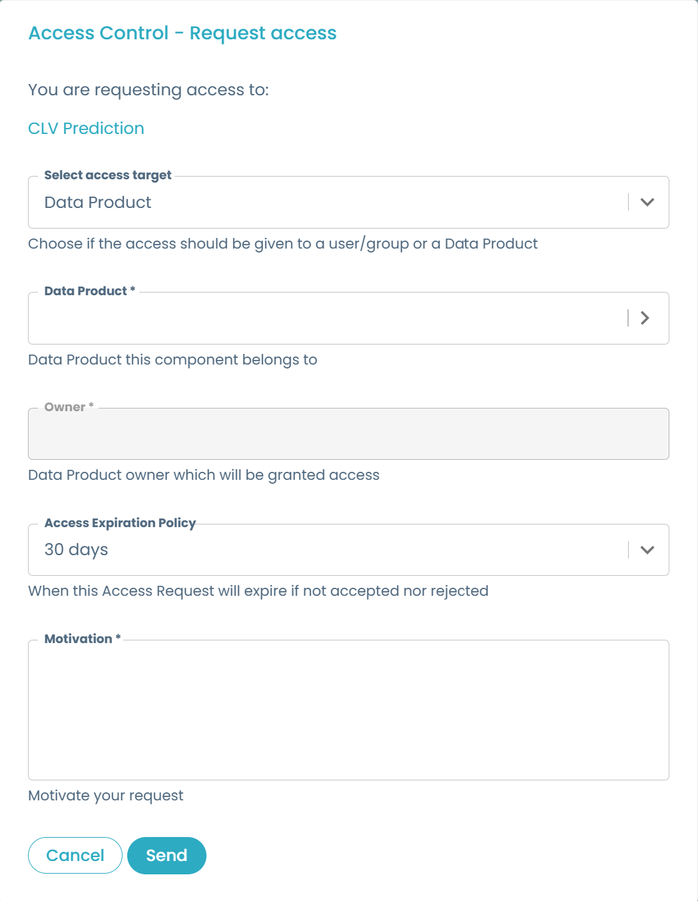

 

    

 

Designed by [Agile Lab](https://www.agilelab.it/), Witboost is a versatile platform that addresses a wide range of sophisticated data engineering challenges. It enables businesses to discover, enhance, and productize their data, fostering the creation of automated data platforms that adhere to the highest standards of data governance. Want to know more about Witboost? Check it out [here](https://www.witboost.com) or [contact us!](https://www.witboost.com/contact-us)

This repository is a guide to our Starter Kit meant to showcase Witboost's integration capabilities and provide a "batteries-included" product.

# Witboost Starter Kit

- [Tech Adapters](#tech-adapters)
- [Templates](#templates)
- [Computational Governance Platform](#computational-governance-platform)
- [Data Contract](#data-contract)
- [Data Catalog Plugins](#data-catalog-plugins)
- [Other Integrations](#other-integrations)
- [Practice Shaper Presets](#practice-shaper-presets)
- [Access Control Request Template](#access-control-request-template)

 
 

## Tech Adapters

### What's a Tech Adapter?

A Tech Adapter (formerly called Specific Provisioner) is a microservice which is in charge of deploying components that use a specific technology. When the deployment of a system (e.g. a Data Product) is triggered, the platform generates its descriptor and orchestrates the deployment of every component contained in the system. For every such component the platform knows which Tech Adapter is responsible for its deployment, and can thus send a provisioning request with the descriptor to it so that the Tech Adapter can perform whatever operation is required to fulfill this request and report back the outcome to the platform.

Tech Adapters were previously called Specific Provisioners, so you might still find this name in most of the repositories while we perform the name transition. So whenever you encounter Specific Provisioner, just read it as Tech Adapter.

You can learn more about how the Tech Adapters fit in the broader picture [here](https://docs.witboost.com/docs/p2_arch/p1_intro/#deploy-flow).

### Available Tech Adapters and Scaffolds

We provide two main kinds of projects:

- Tech Adapters: microservice implementations for a specific technology that you can customize to suit your needs
- Scaffolds: base projects that you can start from if you want to implement a tech adapter yourself

| Tech                                                     | Kind         | Project                                                                                                                     | Scope                                     | Supported components      | Notes                                                                                                                                |
|----------------------------------------------------------|--------------|-----------------------------------------------------------------------------------------------------------------------------|-------------------------------------------|---------------------------|--------------------------------------------------------------------------------------------------------------------------------------|
|             | Tech Adapter | [Airbyte Adapter](https://github.com/agile-lab-dev/witboost-airbyte-specific-provisioner)                                   | ELT - Airbyte                             | Workload                  |                                                                                                                                      |
|             | Tech Adapter | [Airflow Adapter](https://github.com/agile-lab-dev/witboost-mwaa-specific-provisioner)                                      | Scheduling - Airflow/MWAA                 | Workload                  |                                                                                                                                      |
|                | Tech Adapter | [Azure ADLS Storage Area Adapter](https://github.com/agile-lab-dev/witboost-azure-adls-storage-area-specific-provisioner)   | Object Storage - Azure Data Lake Storage  | Storage Area              | Deployable with [Azure ADLS Umbrella Chart](https://github.com/agile-lab-dev/witboost-azure-adls-storage-area-helm)                  |
|                | Tech Adapter | [Azure ADLS Output Port Adapter](https://github.com/agile-lab-dev/witboost-azure-adls-output-port-tech-adapter)             | Object Storage - Azure Data Lake Storage  | Output Port               |                                                                                                                                      |
|              | Tech Adapter | [CDP Impala Adapter](https://github.com/agile-lab-dev/witboost-cdp-impala-specific-provisioner)                             | SQL Query Engine - CDP Impala             | Output Port               |                                                                                                                                      |
|                  | Tech Adapter | [CDP S3 Adapter](https://github.com/agile-lab-dev/witboost-cdp-s3-specific-provisioner)                                     | Object Storage - CDP S3                   | Output Port               |                                                                                                                                      |
|               | Tech Adapter | [CDP Spark Adapter](https://github.com/agile-lab-dev/witboost-cdp-spark-specific-provisioner)                               | Data Processing - CDP Spark               | Workload                  |                                                                                                                                      |
|               | Tech Adapter | [CDP HDFS Adapter](https://github.com/agile-lab-dev/witboost-cdp-hdfs-specific-provisioner)                                 | Distributed File System - CDP HDFS        | Output Port, Storage Area |                                                                                                                                      |
|          | Tech Adapter | [Databricks Adapter - Java](https://github.com/agile-lab-dev/witboost-databricks-tech-adapter)                              | Data Processing - Databricks Spark        | Workload, Output Port     | Uses the Databricks SDK for Java                                                                                                     |
|          | Tech Adapter | [Databricks Adapter - Python](https://github.com/agile-lab-dev/witboost-databricks-python-tech-adapter)                     | Data Processing - Databricks Spark        | Workload, Output Port     | Uses the Databricks SDK for Python                                                                                                   |
|              | Tech Adapter | [Hasura Adapter](https://github.com/agile-lab-dev/witboost-hasura-specific-provisioner)                                     | GraphQL - Hasura                          | Output Port               | Needs the [Hasura Authentication Webhook and Role Mapper](https://github.com/agile-lab-dev/witboost-hasura-auth-webhook-role-mapper) |
|          | Tech Adapter | [Snowflake Adapter](https://github.com/agile-lab-dev/witboost-snowflake-specific-provisioner)                               | DWH - Snowflake                           | Output Port, Storage Area |                                                                                                                                      |
|        | Tech Adapter | [Azure Data Factory Adapter](https://github.com/agile-lab-dev/witboost-azure-datafactory-specific-provisioner)              | ETL - Azure Data Factory                  | Workload                  |                                                                                                                                      |
|             | Tech Adapter | [Microsoft Fabric Output Port Adapter](https://github.com/agile-lab-dev/witboost-microsoft-fabric-output-port-tech-adapter) | DWH - Microsoft Fabric                    | Output Port               |                                                                                                                                      |
|  | Tech Adapter | [Great Expectations Guardian Adapter](https://github.com/agile-lab-dev/witboost-great-expectations-guardian-tech-adapter)   | Data Quality - Great Expectations         | Workload                  |                                                                                                                                      |
|              | Tech Adapter | [Confluent Kafka Adapter](https://github.com/agile-lab-dev/witboost-confluent-kafka-tech-adapter)                           | Streaming - Confluent Kafka               | Output Port               |                                                                                                                                      |
|    | Tech Adapter | [Google BigQuery Adapter](https://github.com/agile-lab-dev/witboost-google-bigquery-tech-adapter)                           | DWH - Google BigQuery                     | Output Port               |                                                                                                                                      |
|         | Tech Adapter | [AWS Athena Adapter](https://github.com/agile-lab-dev/witboost-aws-athena-tech-adapter)                                     | Serverless Query Engine - Amazon Athena   | Output Port               |                                                                                                                                      |
|           | Tech Adapter | [AWS Glue Adapter](https://github.com/agile-lab-dev/witboost-aws-glue-tech-adapter)                                         | Serverless Integration Service - AWS Glue | Workload                  |                                                                                                                                      |
|             | Tech Adapter | [AWS S3 Adapter](https://github.com/agile-lab-dev/witboost-aws-s3-tech-adapter)                                             | Object Storage - AWS S3                   | Storage Area              |                                                                                                                                      |
|            | Tech Adapter | [Argo CD Adapter](https://github.com/agile-lab-dev/witboost-argocd-tech-adapter)                                            | Continuous Delivery - Argo CD             | Workload                  |                                                                                                                                      |
|                | Scaffold     | [Java Scaffold](https://github.com/agile-lab-dev/witboost-java-scaffold)                                                    | Generic - Java                            | NA                        | Uses the [Java Tech Adapter Framework](https://github.com/agile-lab-dev/witboost-java-tech-adapter-framework) library.               |
|              | Scaffold     | [Python Scaffold](https://github.com/agile-lab-dev/witboost-python-scaffold)                                                | Generic - Python                          | NA                        |                                                                                                                                      |
|           | Scaffold     | [Terraform Scaffold](https://github.com/agile-lab-dev/witboost-terraform-scaffold)                                          | Generic - Terraform                       | NA                        |                                                                                                                                      |

 
 

## Templates

### What's a Template?

A Template is a tool that helps create components inside Witboost under a specific Data Landscape (e.g. Data Mesh). Templates help establish a standard across the organization. This standard leads to easier understanding, management and maintenance of components. Templates provide a predefined structure so that developers don't have to start from scratch each time, which leads to faster development and allows them to focus on other aspects, such as testing and business logic.

For more information, please refer to the [official documentation](https://docs.witboost.com/docs/p1_user/p6_advanced/p6_1_templates/#getting-started).

### Available Templates

| Tech                                                                 | Component    | Project                                                                                                                               | Scope                                     | Tech Adapter                                                                                                              | Notes                                                                                                                                       |
|----------------------------------------------------------------------|--------------|---------------------------------------------------------------------------------------------------------------------------------------|-------------------------------------------|---------------------------------------------------------------------------------------------------------------------------|---------------------------------------------------------------------------------------------------------------------------------------------|
|                              | Data Product | [Data Product](https://github.com/agile-lab-dev/witboost-data-product-template)                                                       | NA                                        | No Tech Adapter needed                                                                                                    |                                                                                                                                             |
|                            | Storage Area | [Azure ADLS Storage Area](https://github.com/agile-lab-dev/witboost-azure-adls-storage-area-template)                                 | Data Lake Storage - Azure                 | [Azure ADLS Storage Area Adapter](https://github.com/agile-lab-dev/witboost-azure-adls-storage-area-specific-provisioner) |                                                                                                                                             |
|                            | Output Port  | [Azure ADLS Output Port](https://github.com/agile-lab-dev/witboost-azure-adls-output-port-template)                                   | Data Lake Storage - Azure                 | [Azure ADLS Output Port Adapter](https://github.com/agile-lab-dev/witboost-azure-adls-output-port-tech-adapter)           |                                                                                                                                             |
|                          | Output Port  | [CDP CDW Impala Output Port](https://github.com/agile-lab-dev/witboost-cdp-cdw-impala-output-port-template)                           | SQL Query Engine - CDP CDW Impala         | [CDP Impala Adapter](https://github.com/agile-lab-dev/witboost-cdp-impala-specific-provisioner)                           |                                                                                                                                             |
|                              | Output Port  | [CDP DL S3 Output Port](https://github.com/agile-lab-dev/witboost-cdp-dl-s3-output-port-template)                                     | Object Storage - CDP DL S3                | [CDP S3 Adapter](https://github.com/agile-lab-dev/witboost-cdp-s3-specific-provisioner)                                   |                                                                                                                                             |
|                           | Storage Area | [CDP HDFS Storage Area](https://github.com/agile-lab-dev/witboost-cdp-hdfs-storage-area-template)                                     | Distributed File System - CDP HDFS        | [CDP HDFS Adapter](https://github.com/agile-lab-dev/witboost-cdp-hdfs-specific-provisioner)                               |                                                                                                                                             |
|                           | Output Port  | [CDP HDFS Output Port](https://github.com/agile-lab-dev/witboost-cdp-hdfs-output-port-template)                                       | Distributed File System - CDP HDFS        | [CDP HDFS Adapter](https://github.com/agile-lab-dev/witboost-cdp-hdfs-specific-provisioner)                               |                                                                                                                                             |
|                          | Output Port  | [Hasura Output Port](https://github.com/agile-lab-dev/witboost-hasura-output-port-template)                                           | GraphQL - Hasura                          | [Hasura Adapter](https://github.com/agile-lab-dev/witboost-hasura-specific-provisioner)                                   |                                                                                                                                             |
|                      | Output Port  | [Snowflake Output Port](https://github.com/agile-lab-dev/witboost-snowflake-output-port-template)                                     | DWH - Snowflake                           | [Snowflake Adapter](https://github.com/agile-lab-dev/witboost-snowflake-specific-provisioner)                             |                                                                                                                                             |
|                      | Storage Area | [Snowflake Storage Area](https://github.com/agile-lab-dev/witboost-snowflake-storage-area-template)                                   | DWH - Snowflake                           | [Snowflake Adapter](https://github.com/agile-lab-dev/witboost-snowflake-specific-provisioner)                             |                                                                                                                                             |
|                      | Workload     | [Snowflake SQL Workload](https://github.com/agile-lab-dev/witboost-snowflake-sql-workload-template)                                   | Data processing - Snowflake               | No Tech Adapter needed                                                                                                    | It's triggered by an orchestrator through the [Airflow Workload Template](https://github.com/agile-lab-dev/witboost-mwaa-workload-template) |
|                         | Workload     | [Airbyte Workload](https://github.com/agile-lab-dev/witboost-airbyte-workload-template)                                               | ELT - Airbyte                             | [Airbyte Adapter](https://github.com/agile-lab-dev/witboost-airbyte-specific-provisioner)                                 |                                                                                                                                             |
|                           | Workload     | [CDP CDE Spark Workload](https://github.com/agile-lab-dev/witboost-cdp-cde-spark-workload-template)                                   | Data Processing - CDP CDE Spark           | [CDP Spark Adapter](https://github.com/agile-lab-dev/witboost-cdp-spark-specific-provisioner)                             |                                                                                                                                             |
|                             | Workload     | [DBT Workload](https://github.com/agile-lab-dev/witboost-dbt-workload-template)                                                       | Data processing - DBT                     | No Tech Adapter needed                                                                                                    |                                                                                                                                             |
|                         | Workload     | [Airflow Workload](https://github.com/agile-lab-dev/witboost-mwaa-workload-template)                                                  | Scheduling - Airflow/MWAA                 | [Airflow Adapter](https://github.com/agile-lab-dev/witboost-mwaa-specific-provisioner)                                    |                                                                                                                                             |
|                     | Workload     | [Azure Data Factory Workload](https://github.com/agile-lab-dev/witboost-azure-datafactory-workload-template)                          | ETL - Azure Data Factory                  | [Azure Data Factory Adapter](https://github.com/agile-lab-dev/witboost-azure-datafactory-specific-provisioner)            |                                                                                                                                             |
|               | Workload     | [Great Expectations Guardian Workload](https://github.com/agile-lab-dev/witboost-great-expectations-guardian-workload-template)       | Data Quality - Great Expectations         | [Great Expectations Guardian Adapter](https://github.com/agile-lab-dev/witboost-great-expectations-guardian-tech-adapter) |                                                                                                                                             |
|                           | Output Port  | [Confluent Kafka Output Port](https://github.com/agile-lab-dev/witboost-confluent-kafka-output-port-template)                         | Streaming - Confluent Kafka               | [Confluent Kafka Adapter](https://github.com/agile-lab-dev/witboost-confluent-kafka-tech-adapter)                         |                                                                                                                                             |
|                 | Output Port  | [Google BigQuery Output Port](https://github.com/agile-lab-dev/witboost-google-bigquery-output-port-template)                         | DWH - Google BigQuery                     | [Google BigQuery Adapter](https://github.com/agile-lab-dev/witboost-google-bigquery-tech-adapter)                         |                                                                                                                                             |
|                 | Storage Area | [Google BigQuery Storage Area](https://github.com/agile-lab-dev/witboost-google-bigquery-storage-area-template)                       | DWH - Google BigQuery                     | [Google BigQuery Adapter](https://github.com/agile-lab-dev/witboost-google-bigquery-tech-adapter)                         |                                                                                                                                             |
|                      | Output Port  | [AWS Athena Output Port](https://github.com/agile-lab-dev/witboost-aws-athena-output-port-template)                                   | Serverless Query Engine - Amazon Athena   | [AWS Athena Adapter](https://github.com/agile-lab-dev/witboost-aws-athena-tech-adapter)                                   |                                                                                                                                             |
|                        | Workload     | [AWS Glue Workload](https://github.com/agile-lab-dev/witboost-aws-glue-workload-template)                                             | Serverless Integration Service - AWS Glue | [AWS Glue Adapter](https://github.com/agile-lab-dev/witboost-aws-glue-tech-adapter)                                       |                                                                                                                                             |
|                          | Storage Area | [AWS S3 Storage Area](https://github.com/agile-lab-dev/witboost-aws-s3-storage-area-template)                                         | Object Storage - AWS S3                   | [AWS S3 Adapter](https://github.com/agile-lab-dev/witboost-aws-s3-tech-adapter)                                           |                                                                                                                                             |
|                         | Workload     | [Argo CD Workload](https://github.com/agile-lab-dev/witboost-argocd-workload-template)                                                | Continuous Delivery - Argo CD             | [Argo CD Adapter](https://github.com/agile-lab-dev/witboost-argocd-tech-adapter)                                          |                                                                                                                                             |
|  | Workload     | [Azure AI Document intelligence Workload](https://github.com/agile-lab-dev/witboost-azure-ai-document-intelligence-workload-template) | Document processing - Azure AI            | [Airflow Adapter](https://github.com/agile-lab-dev/witboost-mwaa-specific-provisioner)                                    |                                                                                                                                             |

### Templates Gallery

Looking to build your own template? Check out the [Templates Gallery](https://github.com/agile-lab-dev/witboost-templates-gallery), which contains howtos and practical examples to kickstart the process.

 
 

## Computational Governance Platform

This module enables a true shift left of data governance within the software and data development processes.

It allows the platform team to create, evolve and enforce computational policies and metrics. That means, data governance is no longer just guidelines, it is enforced automatically through code and are not bypassable.

For more information, please refer to the [official documentation](https://docs.witboost.com/docs/p3_tech/p11_managing_policies/p11_1_overview).

### Policies Gallery

Looking to build your own policies that can be used in Witboost either as-is or as a starting point for your custom policies? Check out the [Policies Gallery](https://github.com/agile-lab-dev/witboost-policies-gallery), which contains howtos and practical examples to kickstart the process.

 
 

## Data Contract

To implement an end to end Data Contract mechanism with pluggable architectural pattern, three components are needed.
* **Data Contract Definition Template**: Useful for the end user to define the contract metadata. It is possible to adopt any data contract specification you want ( [Bitol](https://github.com/bitol-io/open-data-contract-standard) or others ).
* **Data Contract Guardian**: This is an autonoumous agent that Witboost injects in all the Data COntracts to actively monitor them and raise alerts in case of Contract Drift. The contract guardian can be implemented with ay technology and architectural pattern, providing huge freedom degrees. Guardian autonomy provides infinite scalability and no bottlenecks to the overall solution.

| Tech       | Guardian            | Project                | Notes                          |
|------------|---------------------|------------------------|--------------------------------|
|  | Batch With Circuit Break     | [Great Expectations Guardian Workload](https://github.com/agile-lab-dev/witboost-great-expectations-guardian-workload-template) | [Great Expectations Guardian Tech Adapter](https://github.com/agile-lab-dev/witboost-great-expectations-guardian-tech-adapter) |

 
 

## Data Catalog Plugins

### What's a Data Catalog Plugin?

A Data Catalog Plugin is an extension point for Witboost that allows publishing entities on an external, pluggable Data Catalog. It is invoked at the end of the provisioning flow and receives the whole information about the entity descriptor, provisioning info, etc.

You can learn more about how Data Catalog plugins fit in the broader picture [here](https://docs.witboost.com/docs/p2_arch/p1_intro/#deploy-flow).

### Available Data Catalog Plugins

| Tech                                                | Kind                | Project                                                                                                        | Scope                       | Notes |
|-----------------------------------------------------|---------------------|----------------------------------------------------------------------------------------------------------------|-----------------------------|-------|
|      | Data Catalog Plugin | [Collibra Data Catalog Plugin](https://github.com/agile-lab-dev/witboost-collibra-data-catalog-plugin)         | Data Catalog - Collibra     |       |
|  | Data Catalog Plugin | [OpenMetadata Data Catalog Plugin](https://github.com/agile-lab-dev/witboost-openmetadata-data-catalog-plugin) | Data Catalog - OpenMetadata |       |

 
 

## Other Integrations

In this section you can find a list of possible integrations. They are not as production ready as the ones above, but are in any way a good starting point to address specific use cases and to understand Witboost capabilities.

| Tech                                            | Kind         | Project                                                                             | Scope                     | Supported components | Notes                              |
|-------------------------------------------------|--------------|-------------------------------------------------------------------------------------|---------------------------|----------------------|------------------------------------|
|  | Tech Adapter | [Ice Panel](https://github.com/agile-lab-dev/IcePanelC4-Adapter)                    | C4 Architecture Diagram   | Data Product         | Needs an IcePanel license          |
|     | Tech Adapter | [Tonic.ai](https://github.com/agile-lab-dev/TonicAI-Adapter)                        | Synthetic Data Generation | Output Port          | Needs a Tonic.ai license           |
|       | Tech Adapter | [DCAT - OWL - RDF](https://github.com/agile-lab-dev/DCAT-OWL-Adapter)               | Data Catalog              | Output Port          | Needs an RDF Triple Store endpoint |
|  | Tech Adapter | [GoodData](https://github.com/agile-lab-dev/witboost-gooddata-specific-provisioner) | Analytics                 | Output Port          | Needs a GoodData license           |
|  | Extension | [MCP Server](https://github.com/agile-lab-dev/Witboost-MCP) | Agentic AI                 |           | Help to connect third party agents to Witboost           |

 
 

## Practice Shaper Presets

### What's the Practice Shaper?

The **Practice Shaper** is the main and most impactful Witboost setting that models entities (domains, systems, components, templates) as nodes of a fully-configurable **property graph**.

This enables data-oriented organizations to shape Witboost based on their unique use cases, structure, and needs.

Thanks to the Practice Shaper, a company can approach any project scenario in data (**Data Landscape**), such as Data Mesh, Business Intelligence, Machine Learning and others, by defining which practices are enabled and regulated, with the possibility to define technological and methodological guardrails.

Refer to the [Witboost documentation](https://docs.witboost.com) to learn more about Practice Shaper and Data Landscapes.

### Available Presets

The [Practice Shaper Presets repository](https://github.com/agile-lab-dev/witboost-practice-shaper-presets) provides some ready-to-import Data Landscapes, allowing organizations to quickly set up and customize their witboost environment to suit specific business needs.

 
 

## Access Control Request Template

The **Access Control Request Template** is the mechanism of Witboost used to configure the information required by the users when requesting access to consumables on the Marketplace.

Refer to the [Witboost documentation](https://docs.witboost.com/docs/p3_tech/p4_access_control/accessRequestTemplate) to learn more about Access Control Request Templates.

### Available Access control request templates

Check out the [Access Control Request Template repository](https://github.com/agile-lab-dev/witboost-default-access-control-request-template) which provides the base set of access control request templates for your platform that you can customize further.

 
 

## License

This project is available under the [Apache License, Version 2.0](https://opensource.org/licenses/Apache-2.0); see [LICENSE](LICENSE) for full details.

## About Witboost

[Witboost](https://witboost.com/) is a cutting-edge Data Experience platform, that streamlines complex data projects across various platforms, enabling seamless data production and consumption. This unified approach empowers you to fully utilize your data without platform-specific hurdles, fostering smoother collaboration across teams.

It seamlessly blends business-relevant information, data governance processes, and IT delivery, ensuring technically sound data projects aligned with strategic objectives. Witboost facilitates data-driven decision-making while maintaining data security, ethics, and regulatory compliance.

Moreover, Witboost maximizes data potential through automation, freeing resources for strategic initiatives. Apply your data for growth, innovation and competitive advantage.

[Contact us](https://witboost.com/contact-us) or follow us on:

- [LinkedIn](https://www.linkedin.com/showcase/witboost/)
- [YouTube](https://www.youtube.com/@witboost-platform)
